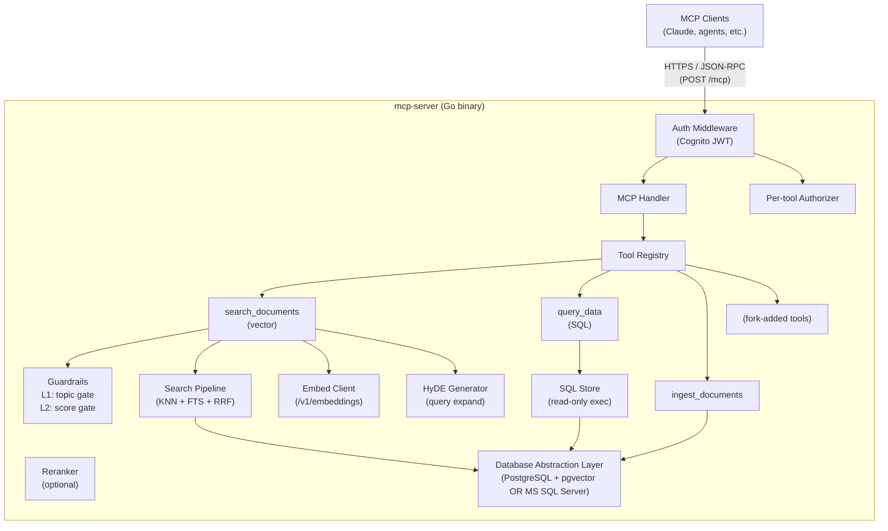
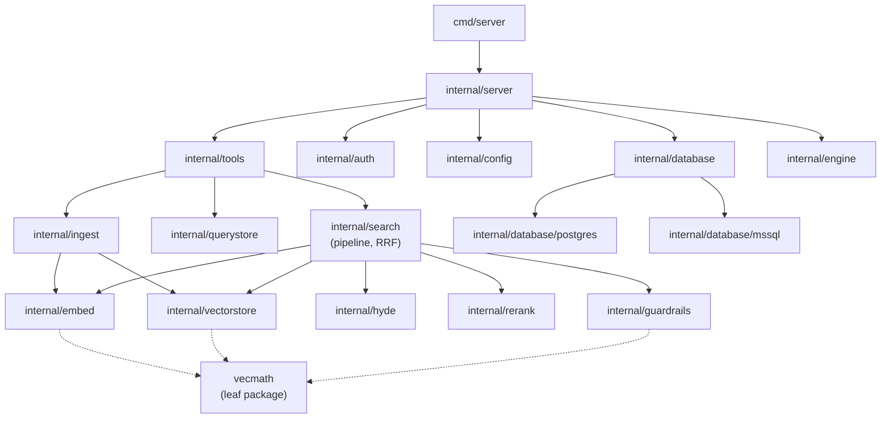
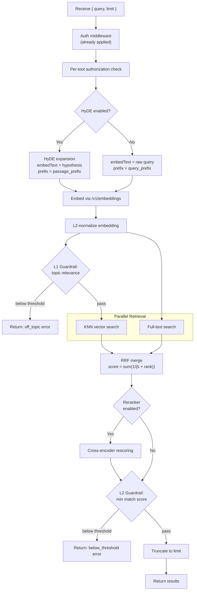

# MCP Authenticated Server -- Design Document

## Overview

A production-ready, fork-friendly Go template for building authenticated MCP (Model Context Protocol) servers backed by a relational database. Provides authentication, database access, vector search, SQL querying, guardrails, health checks, configuration, container orchestration, and MCP protocol handling out of the box.

Fork authors add domain logic (new tools, tables, eval entries) without touching framework code.

## Architecture

## Package Dependency DAG

All imports flow downward. No circular imports.

## Key Design Decisions

| Decision | Resolution |
|----------|-----------|
| Auth provider | AWS Cognito (JWKS + JWT, externally provisioned) |
| Database engines | PostgreSQL (with pgvector) and MS SQL Server |
| Vector on MSSQL | Not supported (permanent constraint) |
| Embed server | External process (e.g., llama-server); bare metal with GPU recommended for performance |
| Container engine | Podman preferred, Docker supported, auto-detected |
| Transport | HTTP/HTTPS only (Streamable HTTP MCP transport) |
| Config format | TOML file + env vars for secrets |
| Config reload | SIGHUP for runtime-tunable sections; structural changes require restart |
| Module structure | Single go.mod at repo root |
| Multi-tenancy | Single shared connection pool; fork authors add per-user filtering |
| Guardrails | Two-level: L1 topic gate (pre-DB), L2 score gate (post-retrieval) |
| Write prevention (MSSQL) | Read-only DB user (primary) + keyword blocking (defense-in-depth) |

## Search Pipeline Flow

## Data Model (PostgreSQL)

**documents** -- one row per ingested file
- id (BIGSERIAL PK), source_path (UNIQUE), title, content, content_hash (SHA-256 prefix), token_count, created_at

**chunks** -- one row per document chunk
- id (BIGSERIAL PK), document_id (FK), chunk_index, content, token_count, heading_context, chunk_type, embedding (vector(N)), content_fts (generated tsvector), created_at
- UNIQUE(document_id, chunk_index)

**build_metadata** -- key/value store for ingest run metadata

Indexes: IVFFlat on embedding (when >= 100 chunks), GIN on content_fts.

## Extension Points

| What | How |
|------|-----|
| Add MCP tools | `tools.Register()` in cmd/server/main.go |
| Add DB tables | New DDL in internal/database/{engine}/schema.go |
| Custom auth policy | Implement `auth.Authorizer` interface |
| Custom chunking | Implement `Chunker` interface |
| Custom embed server | Set `embed.host` to any OpenAI-compatible endpoint |
| Custom guardrails | Add Level 3+ checks in guardrails package |

## Security Invariants

- All SQL: parameterized queries only
- All exec: explicit `[]string` argv, no `sh -c`
- All secrets: env vars only, never config files or logs
- All file reads: validated against allowed directories, no symlink following
- JWT tokens: never logged
- Container: non-root user, pinned base images with SHA256 digest
- Embedding server: external process, not bundled in MCP server container
